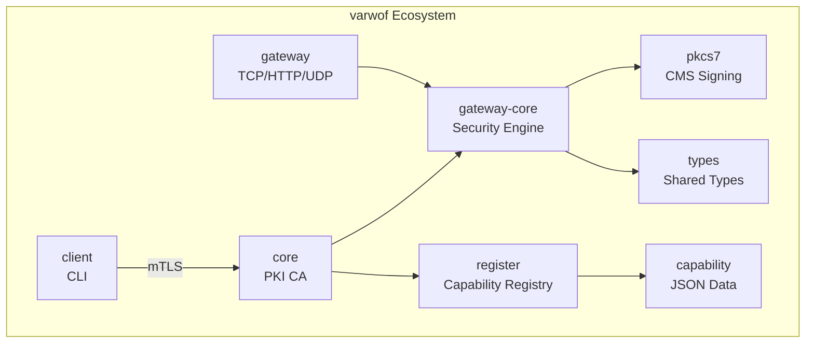

# varwof-pkcs7

> Pure Go PKCS#7 / CMS SignedData signing and verification library. Zero external dependencies.

[](LICENSE)
[](https://pkg.go.dev/github.com/varwof/pkcs7)

[中文](README_CN.md)

## What is varwof-pkcs7?

Pure standard-library PKCS#7 / CMS SignedData signing and verification. Zero external dependencies. Supports ECDSA/RSA/Ed25519, CAdES-T timestamps, and detached signature verification. Used by varwof-core for CA certificate chain signing and code signing.

## Quick Start

```go
import "github.com/varwof/pkcs7"

// Sign
der, err := pkcs7.BuildSignedData(
    pkcs7.OIDData, data, cert, signer, nil,
)

// Verify
signerCert, err := pkcs7.VerifyDetached(der, data)

// Attach CAdES-T timestamp
tsDER, _ := requestTimestamp(der)
signed, _ := pkcs7.AddCAdESTimestamp(der, tsDER)
```

## Installation

```bash
go get github.com/varwof/pkcs7@v0.1.0
```

## Features

- Zero external dependencies, pure standard library
- PKCS#7 SignedData signing (BuildSignedData / BuildSignedDataWithHash / BuildSignedDataWithDigest)
- CAdES-T timestamp attachment (AddCAdESTimestamp)
- Detached signature verification (VerifyDetached)
- Supports ECDSA (P-256/P-384/P-521) / RSA / Ed25519
- Automatic hash algorithm selection based on certificate public key

## Ecosystem



pkcs7 provides CMS signing primitives used by core for code signing and CA certificate chain signing.

## This project is a member of the [Open Invention Network](https://openinventionnetwork.com/).

## Links

| | |
|---|---|
| Homepage | https://varwof.com |
| Community | https://varwof.org |
| IETF Draft | [draft-wei-aic-identity-cert](https://datatracker.ietf.org/doc/draft-wei-aic-identity-cert/) |
| License | Apache-2.0 |
| Member | [Open Invention Network](https://openinventionnetwork.com/) |
